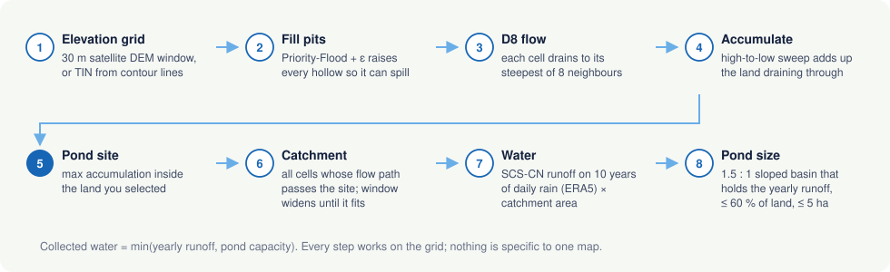
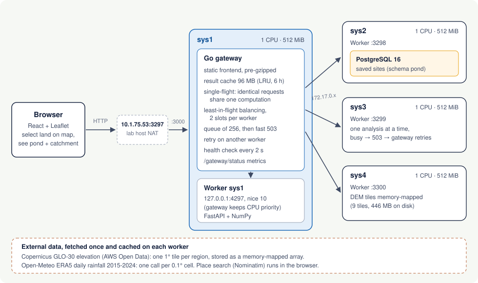

# JalDrishti — village pond planner

Select a piece of village land on a map and get the best place for a pond, the catchment that
feeds it, and the water it can collect in an average year, all drawn on the map.

**Live app: http://10.1.75.53:3297** (IIT Bhilai campus network)

| | |
|---|---|
| Frontend | http://10.1.75.53:3297 |
| API documentation (Swagger) | http://10.1.75.53:3297/docs |
| System status (live workers, cache, latency) | http://10.1.75.53:3297/status |
| Phase 2 route | `POST http://10.1.75.53:3297/analyzeContour` (alias `/findCatchment`) |
| Sample contour map | http://10.1.75.53:3297/api/sample/contour_map |
| Demo video | https://youtu.be/Q3VEN3Mh6os |
| Report (LaTeX source, ACM template) | [`report/`](report/) |

CS559 Computer Systems Design, Assignment 1 (Phases 2 and 3). Roshan Raj, 12341830.

## What it does

1. **Choose the terrain data.** 30 m Copernicus satellite elevation works anywhere; the
   Durg–Bhilai–Raipur region (20–23° N, 80–83° E) is pre-loaded. Or upload a contour map
   (`.kml` / `.kmz`); the bundled `contours_1m.kml` is one click away.
2. **Select the land** where a pond may be dug: draw an outline or a rectangle on the map.
3. **Adjust the design** if needed: pond depth, land cover of the catchment, largest pond.
4. **Get the results**, overlaid on the map:
   * **suggested pond location** (marker and pond footprint inside the selected land),
   * **catchment area** (outline of all land that drains to the pond, with flow paths),
   * **expected water volume** collected per year (label on the map, litres and m³),
   * a to-scale cross-section of the pond, 10 years of rainfall and runoff, and notes.

Results can be saved (shared by everyone through PostgreSQL) or downloaded as GeoJSON.

| Requirement (Phase 3) | Where |
|---|---|
| Fully working front-end | React + Leaflet app served by the gateway |
| Select the land area on a map | Draw outline / Rectangle tools (step 2) |
| Results from the selected land | `POST /api/analyze` with the parcel polygon |
| Pond location, catchment area, water volume | result sheet and map layers |
| Overlaid on the map | pond footprint + marker + volume label, catchment, flow paths, contours |
| Fast, with stress, scaling and system limits considered | gateway cache, admission control, 4 workers; see [Performance](#performance-on-the-four-systems) |

## How the pond site is found



* **Elevation grid.** Satellite mode reads a window of the Copernicus GLO-30 DEM around the
  parcel (1 arc-second lattice, memory-mapped). Contour mode densifies the contour lines and
  builds a Delaunay (TIN) surface on square cells sized to the map, then smooths it by one cell.
* **Priority-Flood + ε** (Barnes et al., 2014) fills pits and gives flats a tiny gradient, so
  every cell has a downhill path; DEM noise can no longer trap water.
* **D8** flow direction: each cell drains to the neighbour with the steepest drop per metre
  (diagonals use the true metric distance, which shrinks with latitude).
* **Flow accumulation**: visiting cells from high to low adds each cell's area to its receiver,
  giving the land area draining through every cell.
* **Pond site**: the cell inside the selected land with the largest accumulation (ties go to
  lower ground). Water already converges there.
* **Catchment**: every cell whose flow path passes through the site. It usually extends beyond
  the parcel; in satellite mode the analysis window is widened (up to ~200,000 cells) until the
  catchment no longer touches its edge.
* **Water**: SCS Curve Number runoff on each day of 2015–2024 rainfall (Open-Meteo ERA5), with
  the curve number adjusted daily for antecedent moisture, averaged per year and multiplied by
  the catchment area.
* **Pond size**: a 1.5 : 1 side-slope basin of the chosen depth, sized to hold the yearly runoff
  but no larger than 60 % of the land or the maximum pond area (5 ha default). Its footprint
  grows from the site over the lowest ground in the parcel, kept compact.
* **Collected water** = min(yearly runoff, pond capacity).

Nothing is specific to one map: all extents, intervals and resolutions come from the input.

## Architecture on the four systems



Only one port is reachable from the campus network: `10.1.75.53:3297`, which the lab host
forwards to port 3000 on sys1. Everything therefore enters through one gateway.

* **Go gateway (sys1)** serves the built frontend (pre-gzipped), and for the API:
  * **least-in-flight load balancing** over four workers with health checks every 2 s;
  * **admission control**: 2 slots per worker (one running, one waiting, since each system has
    one CPU); up to 256 requests wait for a slot for at most 20 s, beyond that the gateway
    answers `503 Retry-After` at once instead of letting latency grow without bound;
  * **retries** on another worker when one is down or reports itself busy;
  * **result cache** (96 MB of gzip, LRU, 6 h) keyed by the request, and **single-flight**:
    identical requests that arrive together share one computation.
* **Workers (sys1–sys4)**: FastAPI + NumPy, one process per system, one analysis at a time.
  The sys1 worker runs at `nice 10` so the gateway always gets the CPU first. DEM tiles are
  memory-mapped, rainfall is cached per 0.1° cell, parsed contour maps and their flow models
  are cached by file hash. BLAS threads are pinned to 1, glibc arenas to 2, and freed memory is
  returned after every analysis, which keeps each worker near 150 MB of the 512 MiB limit.
* **PostgreSQL (sys2)** stores saved sites. Workers are stateless; if the database is down only
  saving is affected.

### Performance on the four systems

Measured from a laptop on the campus network with `deploy/loadtest.py` against the public URL.
"Unique" means every request is a different 400 m × 300 m parcel (real work every time).

| Scenario | Workers | Concurrency | Throughput | Success | p50 latency |
|---|---|---|---|---|---|
| unique parcels | 1 (sys1) | 8 | 2.5 analyses/s | 100 % | 2.9 s |
| unique parcels | 4 | 8 | 9.8 analyses/s | 100 % | 0.61 s |
| unique parcels | 4 | 16 | 8.5–9.5 analyses/s | 100 % | 1.4 s |
| same parcel (cache) | 4 | 64 | 912 responses/s | 100 % | 60 ms |
| 80 % popular, 20 % new | 4 | 32 | 39 responses/s | 100 % | 33 ms |
| overload: unique | 4 | 300 | 10.3 analyses/s | 37 % (rest: fast 503) | 10.6 s |

* Four workers give **3.9×** the throughput of one: the work is CPU-bound and shared-nothing.
* Identical concurrent requests collapse into one computation (63 of 64 shared in the cache test).
* Under 300 concurrent requests throughput stays at capacity, nothing crashes, memory stays near
  150 MB per worker and no process is OOM-killed; excess load is shed with `503 Retry-After`,
  and the frontend retries automatically with jitter.

## API

Interactive documentation: http://10.1.75.53:3297/docs.

| Method | Path | Purpose |
|---|---|---|
| POST | `/api/analyze` | JSON `{"area": <GeoJSON Polygon>, "pond_depth_m": 3, "curve_number": 80, "max_pond_area_m2": 50000}` → analysis on satellite elevation |
| POST | `/api/analyze/contour` | multipart: `contour_map` file (or `use_sample=true`), optional `area` (GeoJSON text) and design parameters |
| POST | `/analyzeContour`, `/findCatchment` | Phase 2 contract: multipart field `contour_map`; response keeps the Phase 2 keys and adds `analysis` |
| GET | `/api/sample`, `/analyzeContour` | analysis of the bundled sample map |
| GET | `/api/sample/contour_map` | the sample KML file |
| GET | `/api/rainfall?lat=&lng=` | rainfall and runoff summary |
| GET | `/api/coverage` | pre-loaded satellite tiles |
| GET / POST / DELETE | `/api/sites` | saved sites |
| GET | `/api/health`, `/gateway/status` | worker health; gateway metrics |

```bash
# Phase 2: contour map upload
curl -F "contour_map=@sample_data/contours_1m.kml" http://10.1.75.53:3297/analyzeContour

# Phase 3: a land parcel (GeoJSON, [longitude, latitude])
curl -H "Content-Type: application/json" http://10.1.75.53:3297/api/analyze -d '{
  "area": {"type": "Polygon", "coordinates": [[[81.2930,21.2610],[81.2968,21.2610],
           [81.2968,21.2637],[81.2930,21.2637],[81.2930,21.2610]]]}}'
```

Main response fields: `pond` (`lat`, `lng`, `elevation_m`, `surface_area_m2`, `depth_m`,
`storage_capacity_m3`, `footprint_geojson`), `catchment` (`area_m2`, `area_ha`, `geojson`),
`water` (`annual_rainfall_mm`, `runoff_depth_mm`, `harvestable_runoff_m3`,
`collectable_volume_m3`, `yearly`), `layers` (`contours`, `streams`), `notes`, `timings_ms`.
Invalid input returns `400` (wrong file type) or `422` (unusable geometry or contour map) with a
message saying what to fix.

## Repository

```
backend/    FastAPI worker: hydrology.py (algorithms), planner.py (site, catchment, sizing),
            dem.py (Copernicus tiles), contours.py (KML/KMZ), rainfall.py, sites.py, tests/
gateway/    Go gateway: static files, load balancing, admission control, cache
frontend/   React + Leaflet app (Vite)
deploy/     bootstrap_host.sh, pondctl.sh (start/stop services), deploy.sh (rolling deploy),
            loadtest.py
docs/       architecture and pipeline diagrams
report/     final report (LaTeX, ACM template) and its figures
sample_data/contours_1m.kml
```

## Running it

Local development (Python 3.12, Node 20, Go 1.23+):

```bash
cd backend && python -m venv venv && . venv/bin/activate && pip install -r requirements.txt
POND_DATA=./data uvicorn main:app --port 8001          # tiles download on first use
python -m pytest -q                                   # engine + API tests
cd ../gateway && go run . -addr 127.0.0.1:3297 -static ../frontend/dist -workers local=http://127.0.0.1:8001
cd ../frontend && npm install && npm run dev          # proxies /api to the deployed gateway
```

Lab deployment: each host has `~/pond.env` (worker name, port, database URL; not committed).
`deploy/bootstrap_host.sh` prepares a host once (Python environment, pre-loaded DEM region);
`deploy/deploy.sh` then builds the frontend, pulls this repository on all four systems, rebuilds
the gateway and restarts the workers one at a time so the site stays up.

## Data and credits

* Elevation: Copernicus GLO-30 DEM © DLR e.V. 2010–2014 and © Airbus Defence and Space GmbH
  2014–2018, provided under COPERNICUS by the European Union and ESA; via AWS Open Data.
* Rainfall: Open-Meteo historical weather API (ERA5 reanalysis, Copernicus Climate Change Service).
* Map tiles: Esri World Imagery, OpenStreetMap contributors, OpenTopoMap. Search: Nominatim.

## Limitations

* The satellite DEM is a surface model at 30 m: trees and buildings raise it slightly, and
  field bunds are invisible. A surveyed contour map gives better results where available.
* ERA5 rainfall smooths out the heaviest storms; runoff is a planning estimate, not a design flood.
* Evaporation and seepage losses from the pond are not modelled. Land ownership must be checked
  separately.
